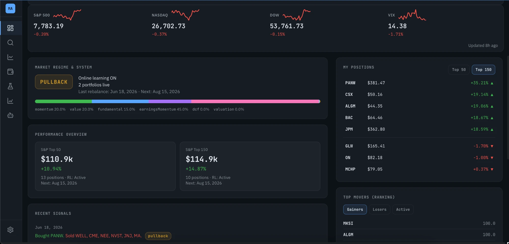

# Market Analysis

**Live:** [market-analysis-iv8o.vercel.app](https://market-analysis-iv8o.vercel.app) — a real, working deploy backed by a scheduled data pipeline and a public API (see [Live deployment & data pipeline](#live-deployment--data-pipeline)), not just a static demo.

A local-first equity-research workbench: multi-factor composite ranking, walk-forward backtests, paper trading, an options scanner / wheel manager, and optional ML and reinforcement-learning overlays.

> Single repo, two processes: a **React + Vite** SPA on `:5173` talking to an **Express** JSON API on `:3001`. Data comes mostly from public Yahoo Finance with optional FRED, Tradier sandbox, and Anthropic / Alpha Vantage hooks.

> **Disclaimer:** This project is for **education and research only**. It is **not financial advice**, not a recommendation to buy or sell any security, and not a live trading system unless you explicitly wire your own broker credentials. Paper portfolios, backtests, and RL agents are illustrative; past simulated performance does not guarantee future results. Use at your own risk.

---

## Highlights

- **Composite ranking** — momentum, value, fundamental, earnings momentum, DCF, and valuation pillars with rolling-IC adaptive weights.
- **Walk-forward backtests** — universes (S&P 500 top 50 / 150, Magnificent 7, Aristocrats), rebalance cadences, regime tagging, factor attribution, monthly heatmaps.
- **Paper trading** — Top 50 / Top 150 portfolios, RL overlay, wheel manager (covered calls + cash-secured puts), full trade history.
- **Options scanner & auto-trader** — academic sell edge (G&S, C&H, B&K), EV / IV-rank / Δ filters, scoring, optional Tradier sandbox execution.
- **Optional ML** — Python random forest / RNN models for rank blending or alpha prediction.
- **Optional RL** — tabular Q-learning or DQN agent that learns a sizing/exposure policy from rebalance histories.

---

## Quick start

### Prerequisites

| Tool | Version | Why |
|------|---------|-----|
| **Node.js** | 20 LTS (or 18.x) | Server + Vite |
| **npm**     | 9+              | Package manager |
| **Python**  | 3.11+ *(optional)* | ML training / blending |
| **jq**      | any *(optional)* | `extract-presentation-data.sh` |

The repo also ships with `.nvmrc` for `nvm`.

### Clone and run

```bash
git clone https://github.com/cliam23/market_analysis.git
cd market_analysis
npm install
cp .env.example .env        # leave it empty for mock data, or fill in keys
npm run dev:all
```

| Service | URL |
|---------|-----|
| Web app (Vite) | http://localhost:5173 |
| JSON API       | http://localhost:3001 |

Stop with **Ctrl+C**. The very first paint can take a few seconds while Yahoo warms its cache.

> **Working directory matters.** Always run scripts from the repo root — paths in `server/config/paths.js` resolve there.

### Backend only / frontend only

```bash
npm run server   # API on :3001 only
npm run dev      # SPA on :5173 only (expects API somewhere)
```

### Production-style local run

```bash
npm run build    # outputs to dist/
npm run server   # serves dist/ from Express + /api routes
```

---

## npm scripts

| Script | What it does |
|--------|--------------|
| `npm run dev:all`        | Recommended: free `:3001`, start API + Vite together |
| `npm run dev`            | Vite only |
| `npm run server`         | API only (`node server.js`) |
| `npm run server:free`    | Helper to free `$PORT` (macOS / Linux) |
| `npm run build`          | Production SPA bundle into `dist/` |
| `npm run preview`        | Vite preview of `dist/` |
| `npm run analyze`        | One-off CLI ranker (`analyze.js`) |
| `npm run pull`           | Yahoo data pull helper |
| `npm run oos-adaptive`   | OOS replay of adaptive composite weights |
| `npm run train-qlearn-both` | Train Q-learning agents for top50 + top150 |
| `npm run verify:golden`  | Golden snapshot replay |
| `npm run warm:gold`      | Warm `data/gold/` bars |
| `npm run snapshot:ui`    | Snapshot dashboard / API responses |
| `npm test`               | Unit tests (`node --test`, 38 tests) — snapshot transform, mirror route handlers, backtest-matrix matcher, analysis mirror, RL agent encode/decode |
| `npm run snapshot:scores`| Regenerate `public/data/scores-snapshot.json` + `public/data/mirror/*.json` (boots server.js, hits its own live endpoints incl. 8 full backtests, ~450 per-ticker analysis/DCF/comps requests, and the Alpha Lab diagnostics sweep — an hour or more) — see [Live deployment](#live-deployment--data-pipeline) |

---

## Configuration

All variables live in **`.env`** (gitignored). Copy from `.env.example` and fill in only what you need — the app boots with mock data when keys are absent.

### Core

| Variable | Purpose |
|----------|---------|
| `NODE_ENV`   | `development` or `production` |
| `PORT`       | API port (default `3001`) |
| `DATA_DIR`   | Persistent volume for runtime JSON (e.g. Railway or Docker: `/data`) |
| `FRONTEND_URL` | CORS origin for split-deployed UI |
| `VITE_API_TARGET` | Vite dev-server proxy target (default `http://localhost:3001`) |
| `VITE_API_BASE`   | Absolute API URL baked into a built SPA |

### Optional data providers

| Variable | Provider | Free? |
|----------|----------|-------|
| `FRED_API_KEY` | [FRED](https://fred.stlouisfed.org) — U.S. macro / CPI | yes |
| `FMP_API_KEY` | [Financial Modeling Prep](https://financialmodelingprep.com) — Senate STOCK Act trades for congress signal; ~250 free calls/day; refreshed weekly; omit for score 0 | yes |
| `TRADIER_SANDBOX_TOKEN` + `TRADIER_ACCOUNT_ID` | [Tradier](https://documentation.tradier.com/sandbox) — real options chains | sandbox is free |
| `VITE_AV_KEY` | [Alpha Vantage](https://www.alphavantage.co) — quote fallback | free tier |
| `VITE_ANTHROPIC_API_KEY` | Anthropic — only if you wire LLM helpers | paid |

If none are set, options chains use a deterministic mock generator and CPI is treated as flat — backtests still run.

### Optional ML, RL, diagnostics

See **`.env.example`** for the full list of toggles (`ML_RANK_WEIGHT`, `RL_ENABLED`, `RL_AGENT_TYPE`, `ROLLING_IC_PERIODS`, `TRAILING_STOP_ENABLED`, plus a handful of debug-log switches).

---

## Repository layout

```
.
├─ src/                      # React UI (Vite)
│  ├─ App.jsx, main.jsx
│  ├─ components/            # Dashboard, Search, Backtest, PaperTrade, Wheel, Options, RL, About, …
│  ├─ assets/                # Bundled JSON fixtures
│  ├─ hooks/                 # useAbortableApi, useBackendMode (full vs. lite-mirror deploy detection)
│  └─ lib/, utils/           # API client, formatters, education content
├─ server/                   # Modular server (config, data, scoring, paper-trade, options, RL, routes)
│  ├─ index.js               # Re-exports app from root server.js
│  └─ README.md
├─ server.js                 # Top-level Express app (legacy single-file entry)
├─ analysis-engine.js        # Pillar scoring, comps/DCF inputs, backtest rankers
├─ adaptiveWeights.js        # Rolling-IC adaptive composite weights
├─ q-learning-agent.js       # Tabular Q-learning agent (shared client/server)
├─ dqn-agent.js              # DQN agent (Node, optional tfjs-node)
├─ options-service.js        # Options chain fetch (Tradier / mock)
├─ options-auto-trader.js    # Scanner + auto-trader loop
├─ wheel-portfolio-service.js# Covered-call / CSP wheel manager
├─ pull-data.js, analyze.js  # CLI utilities
├─ api/                      # Vercel serverless functions — public, read-only mirror
│  ├─ scores.js              # GET /api/scores (see Live deployment)
│  ├─ dashboard/summary.js, market/indices.js
│  ├─ paper-trade/[...path].js  # portfolio/history/preview, one catch-all fn
│  ├─ rl/[...path].js           # status/compare/policy, one catch-all fn
│  ├─ backtest/[universeId].js  # fixed matrix only — see below
│  ├─ analysis/[ticker].js, dcf/[ticker].js, comps/[ticker].js  # sp500_top150 tickers only — see below
│  └─ diagnostics/[...path].js  # universe-compare/hedge-impact/forward-confidence/factors/equity-curves, one catch-all fn — fixed universe×period combo only
├─ public/data/               # scores-snapshot.json + mirror/*.json — pipeline output
├─ scripts/                  # OOS replay, golden snapshots, qlearning trainer, etc.
│  ├─ generate-scores-snapshot.mjs  # Data pipeline: boots server.js, writes snapshot + mirror
│  └─ lib/build-snapshot.mjs, lib/read-mirror.mjs, lib/backtest-mirror.mjs, lib/analysis-mirror.mjs  # Pure transforms, unit-tested separately
├─ test/                     # node:test unit tests (snapshot transform, mirror handlers, backtest matrix, RL agent)
├─ .github/workflows/        # ci.yml (tests + build), scheduled-pipeline.yml (cron data refresh)
├─ ml/                       # Python: train_rf*, train_rnn, predict workers
├─ models/                   # Trained sklearn / pytorch artifacts (joblib / pt)
├─ data/                     # gold/ bars, local-snapshots/  (both gitignored)
├─ docs/                     # API.md, DATA_CONTRACTS.md, SECURITY.md, slide PDF
├─ graphify-out/             # Knowledge-graph reports for the codebase
├─ Dockerfile, .dockerignore
├─ railway.json, vercel.json
└─ README.md
```

### Tracked runtime / seed JSON

These live at the repo root so the app boots with sensible state on a fresh persistent volume. They are *seed data*, not secrets — you can wipe them or move them to `$DATA_DIR` at any time.

- `paper-portfolio.json`, `paper-portfolio-top50.json`, `paper-portfolio-top150.json`
- `wheel-portfolio.json`, `options-portfolio.json`, `options-auto-portfolio.json`
- `rl-agent-top50.json`, `rl-agent-top150.json` (Q-learning)
- `public/data/scores-snapshot.json`, `public/data/mirror/*.json` — seed content for the public Vercel API routes; the scheduled pipeline overwrites both on its own cadence (see [Live deployment](#live-deployment--data-pipeline))

Anything else (DQN, training reports, sweep outputs, caches, presentation export) is gitignored and regenerated on demand.

---

## How it runs locally (architecture)

```
 Browser (Vite :5173)
        │
        │  GET/POST /api/*
        ▼
 Express (Node :3001, server.js)
   ├─ analysis-engine.js   ← composite ranker
   ├─ adaptiveWeights.js   ← rolling-IC weights
   ├─ q-learning-agent.js  ← RL overlay (optional)
   ├─ options-* / wheel-*  ← options + wheel
   ├─ server/data, server/scoring, server/backtest …
   └─ ml/predict_worker.py ← spawned only if ML_* flags set
        │
        ▼ on disk
   .cache/yahoo, .cache/earnings   ← Yahoo / earnings caches
   data/gold/bars                  ← normalized daily bars (optional)
   *-portfolio*.json, rl-agent-*.json, dqn-*.json (state)
```

Dependency direction inside `server/`: `config → utils → data → scoring → backtest`. Use `server/config/paths.js` for repo-root-relative file resolution; do not hard-code paths.

---

## UI tour

| Tab | Purpose |
|-----|---------|
| **Dashboard** *(default)* | Indices, regime + system status, adaptive weight bar, performance tiles, signal feed, factor pulse, paper positions, movers |
| **Search**       | Single-ticker composite + pillar detail |
| **Backtest**     | Walk-forward simulation vs benchmark with regime tagging |
| **Paper Trade**  | Top 50 / Top 150 portfolios, holdings (with Congress signal column), rebalance, RL toggle, wheel layer *(the Wheel sub-tab and every mutating control are hidden on the read-only Vercel deploy — see [Live deployment](#live-deployment--data-pipeline))* |
| **Options**      | Portfolio KPIs, strategy backtest, auto-trader, scanner (G&S, C&H, B&K), manual + auto positions, full close-reason history *(nav item hidden entirely on the read-only Vercel deploy — needs live options chains + mutable state)* |
| **RL Agent**     | Train and compare Q-learning or DQN *(Train card hidden on the read-only Vercel deploy; policy/compare are mirrored and work)* |
| **About**        | In-app docs (pillars, paper vs backtest, RL, options & wheel, data limits) |

The first paint opens **Dashboard**; selecting a ticker from the search panel switches to **Search**.

---

## Optional: Python ML

```bash
python3 -m venv .venv
source .venv/bin/activate         # Windows: .venv\Scripts\activate
pip install -r ml/requirements.txt

python3 ml/train_rf.py            # writes models/rf_regressor.joblib + metrics
python3 ml/train_rnn.py           # writes models/rnn.pt + config
```

Then enable blending via `ML_RANK_WEIGHT`, `ML_ALPHA_RANKING`, `ML_COMPOSITE_ANALYSIS`, or `ML_COMPOSITE_CLUSTER` in `.env`. Node automatically uses `.venv/bin/python3` when present.

## Optional: RL overlay

Train via the **`POST /api/rl/train`** route (body: `universeId`, `period`, `episodes`, `strategy`, optional `gamma`). Diagnose with `GET /api/rl/status`, `/api/rl/policy`, `/api/rl/compare`, `/api/rl/oracle`. Set `RL_ENABLED=true` to actually use a trained agent, and `RL_AGENT_TYPE=qlearning|dqn` to pick the file.

## Presentation snapshot

With the API running on `:3001`:

```bash
bash extract-presentation-data.sh   # ~3–4 minutes, requires jq
```

Writes a self-contained `presentation-data.json` (gitignored).

---

## Documentation

- [`docs/API.md`](docs/API.md) — HTTP routes by area.
- [`docs/DATA_CONTRACTS.md`](docs/DATA_CONTRACTS.md) — data shapes, gold layer, verification.
- [`docs/SECURITY.md`](docs/SECURITY.md) — threat model, ML spawning, secrets handling.
- [`server/README.md`](server/README.md) — module breakdown.

A smoke check after starting the server:

```bash
curl -sS "http://localhost:3001/api/backtest/sp500_top150?period=1y&rebalanceFreq=bimonthly&topN=15&strategy=full_composite&rlAgent=false&fresh=true" \
  | jq '{cached, computedAt, return: .performance.totalReturn}'
```

---

## Deployment

The repo includes config for common split-deploy setups (Railway API + Vercel UI) plus plain Docker — or roll your own. **Always set `DATA_DIR`** to a persistent volume so portfolio / RL state survives restarts.

### Railway (Nixpacks, persistent volume)

`railway.json` uses the Nixpacks builder, runs `node server.js`, and points the health check at `/health`. Add a Railway volume mounted at `/data` and set `DATA_DIR=/data`.

### Vercel — static SPA + serverless public API

`vercel.json` builds the SPA (`npm run build`, `dist/`) **and** deploys `api/scores.js` as a Node serverless function, so a Vercel-only deploy is no longer frontend-only — it ships a small, genuinely public backend without needing an always-on Express process (Vercel doesn't run one). See **[Live deployment & data pipeline](#live-deployment--data-pipeline)** below for the full picture, and the [Vercel setup steps](#connecting-vercel) to go live.

If you *also* run the full Express server elsewhere (Railway, Docker), point `VITE_API_BASE` at that host and add the Vercel domain to `FRONTEND_URL` for CORS — the two are independent: `VITE_API_BASE` covers the full `/api/*` surface (paper trade, backtests, options, …), while `/api/scores` works standalone on Vercel with no other backend required.

### Docker

```bash
docker build -t market-analysis .
docker run --rm -p 3001:3001 \
  -e DATA_DIR=/data -v market_data:/data \
  --env-file .env market-analysis
```

---

## Live deployment & data pipeline

**Pipeline, end to end:** data in (Yahoo Finance) → composite score (`analysis-engine.js` pillar ranking) → RL agent (`q-learning-agent.js` sizing/exposure decision) → dashboard (public API + React SPA). The full diagram is below; the short version is the public Vercel deploy ships three real, connected pieces instead of a static demo:

1. **Scheduled data pipeline** — `.github/workflows/scheduled-pipeline.yml` runs on a cron (weekdays, after US market close) and on manual dispatch. It calls `node scripts/generate-scores-snapshot.mjs`, which boots the real `server.js` on a scratch port and hits **its own production endpoints** — `GET /api/scan/sp500_top50` (live composite scan against fresh Yahoo data), `GET /api/dashboard/summary`, `GET /api/market/indices`, `GET /api/paper-trade/portfolio` + `/history` + `/preview` (both universes), `GET /api/rl/status`, `GET /api/backtest/:universeId` **eight times** (fixed matrix — see `scripts/lib/backtest-mirror.mjs`), `GET /api/analysis/:ticker` + `/api/dcf/:ticker` + `/api/comps/:ticker` for **every ticker in sp500_top150** (~450 requests — see `scripts/lib/analysis-mirror.mjs`), and, per universe, `GET /api/diagnostics/{universe-compare,factors,hedge-impact,equity-curves,forward-confidence}` + `GET /api/rl/{compare,policy}` at `period=3y` (see `scripts/lib/diagnostics-mirror.mjs`). It writes `public/data/scores-snapshot.json` plus a read-only mirror of those other routes to `public/data/mirror/*.json`, and commits it all. No scoring or backtest logic is reimplemented — the pipeline reuses the exact code path the local app uses, so there's nothing to keep in sync. Between the 8 full backtests, ~450 per-ticker requests, and the diagnostics sweep, a full pipeline run takes a while (an hour or more).
2. **Public API endpoints** — `api/scores.js`, `api/dashboard/summary.js`, `api/market/indices.js`, `api/paper-trade/[...path].js` (portfolio/history/preview), `api/rl/[...path].js` (status/compare/policy), `api/backtest/[universeId].js`, `api/analysis/[ticker].js`, `api/dcf/[ticker].js`, `api/comps/[ticker].js`, and `api/diagnostics/[...path].js` (universe-compare/hedge-impact/forward-confidence/factors/equity-curves) are Vercel Node serverless functions that replay those captured routes at their *exact same paths* as `server.js` — the three catch-all functions each dispatch internally on the first path segment rather than being one file per route, to stay under the Hobby plan's 12-serverless-functions-per-deployment cap (`api/scores.js` takes `?ticker=`, most others take `?universe=` or `?universeId=`). Because the paths and response shapes match exactly, the existing frontend components (Dashboard, Paper Trade, RL Agent, Alpha Lab, Search, DCF/Comps) work against them unmodified — they don't know or care that the data is a periodic mirror instead of a live process. The Backtest tab and Alpha Lab are the exceptions: `src/hooks/useBackendMode.js` detects the mirror deploy at runtime (via `api/health.js`'s `mode: "lite"`) and their Universe/Period/Strategy controls narrow to just the mirrored matrix, defaulting to a working combo — so every "Run" action always returns the real captured response instead of a dead end, and there's nothing to misconfigure. `server.js` exposes identical routes for local-dev parity (except the endpoints that always run live locally — the mirror only stands in when there's no server at all). **This only covers read (`GET`) routes** — actions that mutate state (rebalance, create/reset portfolio, RL training, options trades) need `server.js` actually running somewhere; on the Vercel-only deploy their buttons, toggles, and nav entries are **removed from the page entirely** rather than shown disabled (see below), and the Dashboard shows a "Read-only public mirror" banner when serving mirrored data so this is clear in the UI.

**Search works too** — `GET /api/analysis/:ticker`, `GET /api/dcf/:ticker`, and `GET /api/comps/:ticker` are all mirrored for every ticker in `sp500_top150` (a superset of `sp500_top50`, so both paper portfolios' holdings are always covered — see `scripts/lib/analysis-mirror.mjs`). Search any of those tickers on the live deploy, including its DCF and Comps sub-tabs, and you get the real composite score, pillar breakdown, moat analysis, DCF valuation, comps table — everything, not a placeholder. Search on a ticker outside that list falls back to a clear "not available" message instead of a 404.

Alpha Lab's diagnostics (universe comparison, factor strength, hedging impact, the equity-curves chart, forward confidence, and `/api/rl/compare` + `/api/rl/policy`) are mirrored for a **fixed combo** — `sp500_top50` / `sp500_top150` at `period=3y` — so the tab's period selector narrows to `3y` only in lite mode and everything above renders with real data. What's genuinely not mirrored — forward-weight-recommendation and the weight sweep (both weight-sweep-shaped, too expensive to precompute), RL training, and the Options tab / Wheel sub-tab / every paper-trade mutating action (all live or mutable state) — isn't shown disabled with a tooltip; `useBackendMode()` removes those buttons, toggles, and nav entries **from the page entirely** in lite mode; they render normally and work wherever `server.js` is actually running (local dev, Railway, Docker, …).

### Nothing on the live deploy can write anywhere — verified, not assumed

Every function under `api/` (`scores.js`, `dashboard/summary.js`, `market/indices.js`, `paper-trade/[...path].js`, `rl/[...path].js`, `backtest/[universeId].js`, `analysis/[ticker].js`, `dcf/[ticker].js`, `comps/[ticker].js`, `diagnostics/[...path].js`, `health.js`) only ever calls `readFileSync` — none of them import `writeFileSync` or touch any mutable state, and each one rejects any request that isn't `GET`/`HEAD` with `405` via `requireGet()` in `scripts/lib/read-mirror.mjs` (tested in `test/require-get.test.mjs`). So even if someone tried to hit a mutating-looking path on the live URL — resetting a portfolio, closing an options position, triggering RL training — there's no code there that would do it; Vercel's routing has no matching function for any of those paths, and every read-only function that *does* exist would reject a non-GET method outright regardless.

And even setting that aside: **the live Vercel deploy and your local machine are entirely separate infrastructure.** Vercel builds and runs its own copy of this repo in its own containers — nothing a visitor does there can reach your computer's filesystem, your local `paper-portfolio-*.json`, or your local `rl-agent-*.json`. The only data flow in either direction is: (1) the scheduled pipeline computing fresh data and committing it to GitHub, and (2) you running `git pull` on your own machine whenever you choose to. Nobody else can push to this repo or trigger that pull.
3. **CI/CD with tests** — `.github/workflows/ci.yml` runs `npm test` (unit tests for the snapshot transform, the mirror-read helper, the backtest-matrix matcher, the `/api/scores` and mirror route handlers, and RL agent state/action encode-decode round trips — `test/*.test.mjs`, Node's built-in test runner, no extra dependency) and a production build on every push/PR to `main`.

```
                     ┌─────────────────────────────────────────────┐
                     │  GitHub Actions — scheduled-pipeline.yml     │
                     │  (cron: weekdays after close, or dispatch)   │
                     │                                               │
  Yahoo Finance ────▶│  node server.js (scratch port, transient)    │
  (data in)          │    ├─ GET /api/scan/:universe   ─▶ composite │
                     │    │     score (analysis-engine.js pillars)  │
                     │    ├─ GET /api/rl/status        ─▶ RL agent  │
                     │    │     decision (q-learning-agent.js,      │
                     │    │     trained rl-agent-top50.json)        │
                     │    ├─ GET /api/dashboard/summary ─▶ regime   │
                     │    ├─ GET /api/market/indices                │
                     │    ├─ GET /api/paper-trade/{portfolio,history,│
                     │    │        preview}                          │
                     │    ├─ GET /api/backtest/:universe ×8  ─▶ full│
                     │    │     equity curves (Top50/150 × 3y/5y ×  │
                     │    │     RL on/off, Full Composite)          │
                     │    ├─ GET /api/{analysis,dcf,comps}/:ticker  │
                     │    │     × ~150 tickers (sp500_top150)       │
                     │    └─ GET /api/diagnostics/* + /api/rl/      │
                     │          {compare,policy} × Top50/150 @ 3y   │
                     │                                               │
                     │  writes public/data/scores-snapshot.json     │
                     │  and public/data/mirror/*.json, commits ─────┼──┐
                     └─────────────────────────────────────────────┘  │
                                                                        │ push
                                                                        ▼
                                                        ┌────────────────────────────┐
                                                        │  Vercel (auto-redeploy)    │
                                                        │  ├─ dist/  (React SPA)     │
                                                        │  └─ api/  (serverless):    │
                                                        │     scores, dashboard/     │
                                                        │     summary, market/       │
                                                        │     indices, paper-trade/  │
                                                        │     [...path], rl/         │
                                                        │     [...path], backtest/   │
                                                        │     [universeId], analysis/│
                                                        │     dcf/comps/[ticker],    │
                                                        │     diagnostics/[...path]  │
                                                        │     — public, read-only,   │
                                                        │     same paths server.js   │
                                                        │     would serve            │
                                                        └──────────────┬─────────────┘
                                                                        │ GET /api/*
                                                                        ▼
                                                        Dashboard, Search, Backtest,
                                                        Paper Trade, RL Agent, Alpha Lab
                                                        tabs — unmodified, work against
                                                        the mirror like it's live
```

### Connecting Vercel

Vercel account setup and repo authorization are steps only you can do — here's the exact path:

1. Push this repo to GitHub (already done: `cliam23/market_analysis`).
2. At [vercel.com](https://vercel.com), sign in and **Add New → Project → Import** the `cliam23/market_analysis` GitHub repo. Vercel auto-detects `vercel.json` (framework: Vite, build: `npm run build`, output: `dist/`) — no config needed.
3. Deploy. Vercel gives you a `*.vercel.app` URL (this repo's is [market-analysis-iv8o.vercel.app](https://market-analysis-iv8o.vercel.app)); every push to `main` (including the scheduled pipeline's commits) redeploys automatically.
4. On the repo's **Settings → Actions → General → Workflow permissions**, confirm **"Read and write permissions"** is selected — the scheduled pipeline needs this to commit the snapshot and mirror files back to `main`.
5. Optionally trigger the pipeline once by hand (Actions tab → *Scheduled scores pipeline* → **Run workflow**) so the first deploy already has fresh data instead of the seed files committed in this repo.

No environment variables or secrets are required for the Vercel deploy itself — `/api/scores` reads a file bundled with the deployment, and the scheduled pipeline uses GitHub's default `GITHUB_TOKEN`.

### Screenshot



The live [market-analysis-iv8o.vercel.app](https://market-analysis-iv8o.vercel.app) Dashboard, showing real mirrored data: regime badge, adaptive weights, both paper portfolios' performance, live positions, and top movers.

---

## Security & data notes

- **Never commit `.env`.** `.gitignore` covers `.env`, `.env.local`, `.env.production`.
- The repo contains **no real credentials**; verified against tracked files and full git history before publication.
- Tradier sandbox tokens are *paper money only* — there are no production order paths.
- Yahoo data is best-effort. Backtest results are simulations, not investment advice.

See `docs/SECURITY.md` for spawn boundaries, ML subprocess surface, and audit notes.

---

## Troubleshooting

| Symptom | Try |
|---------|-----|
| Blank API / CORS errors | API on `PORT`, Vite proxy at `VITE_API_TARGET`, or set `FRONTEND_URL` for split deploys |
| Slow / failing Yahoo backtests | Network or rate limits; retry, check `[Yahoo]` server logs, warm `data/gold/` |
| RL toggle does nothing | `RL_ENABLED=true` **and** the matching `rl-agent-top*.json` / `dqn-agent.json` exists for `RL_AGENT_TYPE` |
| Paper portfolio errors | Init via `POST /api/paper-trade/init`; holdings live under `holdings`, not `positions` |
| Options chains look fake | Without `TRADIER_SANDBOX_TOKEN` the server uses a deterministic mock by design |
| Congress score always 0 | Set `FMP_API_KEY` (free signup), restart server. Logs show `[Congress] FMP` on errors. Weekly refresh uses Senate-only (1 call/ticker) to stay under 250 calls/day |

---

## Contributing

This is a personal research project published for visibility. Issues and small PRs (typos, docs, obvious bugs) are welcome; please open an issue for anything bigger so we can sanity-check the direction first.

## License

[MIT](LICENSE) — see the license file for full terms. `"private": true` in `package.json` means this repo is not published to npm; GitHub visibility is separate.
