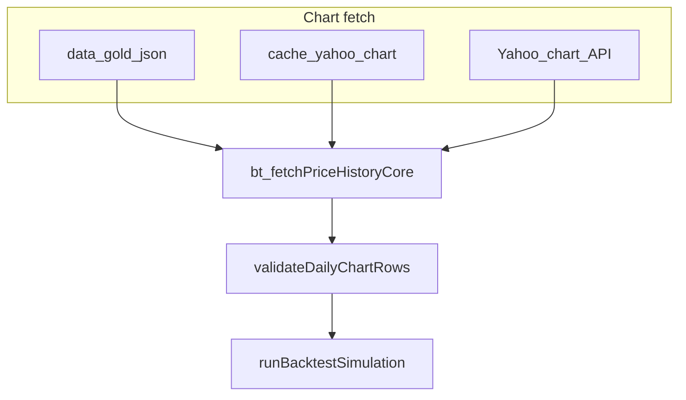

# Data contracts and pipeline map

This document matches the **Data cleanup, speed, and trust** plan ($0 budget): canonical shapes, where data enters the app, and how to extend without breaking callers.

## Canonical shapes

### Daily OHLC (backtest / momentum charts)

Consumed by `runBacktestSimulation` and related paths. Each row:

| Field | Type | Notes |
|-------|------|--------|
| `date` | `YYYY-MM-DD` | Trading calendar; sorted ascending |
| `open`, `high`, `low`, `close` | number | `close` required; highs/lows may equal close if missing |
| `volume` | number | optional |

**Source:** Yahoo Finance `chart` via `yahoo-finance2`, normalized in [server.js](file:///Users/mochi/Documents/Market Analysis/server.js) (`mapQuotes` inside `bt_fetchPriceHistoryCore`). Validation: [server/data/bar-validation.js](../server/data/bar-validation.js).

### Quote snapshot (single-ticker UI)

**Source:** [server/data/yahoo-disk-cache.js](../server/data/yahoo-disk-cache.js) + Yahoo `quoteSummary` / quote modules in [server.js](../server.js). Best-effort for live prices; not used for golden parity (backtest KPIs are the contract).

### Fundamentals / earnings

**Source:** `fetchFundamentals`, earnings fetchers in [server/data/earnings-fetch.js](../server/data/earnings-fetch.js), scoring in [server/scoring/](../server/scoring/). Point-in-time rules are enforced in the analysis/backtest engine; changing filed dates changes outputs—document any PIT change in release notes.

## Pipeline map (high level)

| Area | Module / entry | Notes |
|------|----------------|-------|
| Chart OHLC for backtest | `bt_fetchPriceHistory` → `bt_fetchPriceHistoryCore` in [server.js](../server.js) | Order: **gold** ([server/data/gold-bars-store.js](../server/data/gold-bars-store.js)) → fresh disk ([server/data/yahoo-disk-cache.js](../server/data/yahoo-disk-cache.js)) → Yahoo live → stale disk |
| Validation | [server/data/bar-validation.js](../server/data/bar-validation.js) | `DATA_VALIDATION_STRICT=true` rejects bad series (strict path returns null upstream) |
| Per-run stats | [server/data/bt-fetch-stats.js](../server/data/bt-fetch-stats.js) | Feeds `dataQuality` on backtest JSON |
| Universes | [server/config/universes.js](../server/config/universes.js) | `UNIVERSE_TICKERS`, `UNIVERSES` |
| Paths | [server/config/paths.js](../server/config/paths.js) | `DATA_GOLD_BARS_DIR`, `.cache/yahoo`, etc. |

## Environment flags

| Variable | Effect |
|----------|--------|
| `DATA_GOLD_LAYER=1` | Prefer local files under `data/gold/bars/` when fresh (see [server/data/gold-bars-store.js](file:///Users/mochi/Documents/Market Analysis/server/data/gold-bars-store.js)) |
| `DATA_GOLD_WRITE=1` | After a successful Yahoo fetch in backtest, persist rows to gold (optional automation) |
| `DATA_GOLD_MAX_AGE_DAYS` | Max age for gold reads (default `7`) |
| `DATA_VALIDATION_STRICT=true` | Invalid bar series fail the fetch path (simulation may error if data missing) |

## Local gold layer

- **Directory:** `data/gold/bars/` (gitignored via `data/gold/`).
- **Populate:** `npm run warm:gold -- --universe sp500_top150 --years 5`
- **Format:** One JSON file per ticker: `{ updatedAt, ticker, rows: [...] }`.

## Golden parity

See [server/README.md](../server/README.md). Script: `npm run verify:golden` — compares live backtest KPIs to [scripts/golden-baseline.json](../scripts/golden-baseline.json) within tolerance after you run `--capture` once.

## Local UI snapshots (Dashboard)

Files under `data/local-snapshots/` (`market-indices.json`, `dashboard-summary.json`), written by `npm run snapshot:ui` or `LOCAL_UI_SNAPSHOT_WRITE=1` after a live request.

| Variable | Effect |
|----------|--------|
| `LOCAL_UI_SNAPSHOTS=1` | Prefer snapshot when fresh |
| `LOCAL_UI_SNAPSHOT_WRITE=1` | After building live payload, write snapshot file |
| `LOCAL_UI_SNAPSHOT_MAX_AGE_MS` | Max age to trust snapshot (default 300000) |

Implementation: [server/data/local-ui-snapshots.js](../server/data/local-ui-snapshots.js).

## Deferred: second free source (optional)

Not implemented. If Yahoo systematic gaps remain after validation + gold, add a **second adapter** (e.g. cross-check or failover) behind the same `bt_fetchPriceHistory` boundary, re-run golden + manual parity, and document symbol mapping (e.g. BRK.B) in this file.
